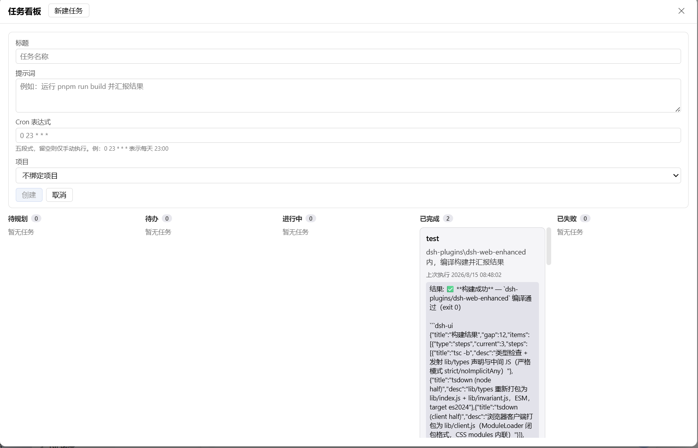
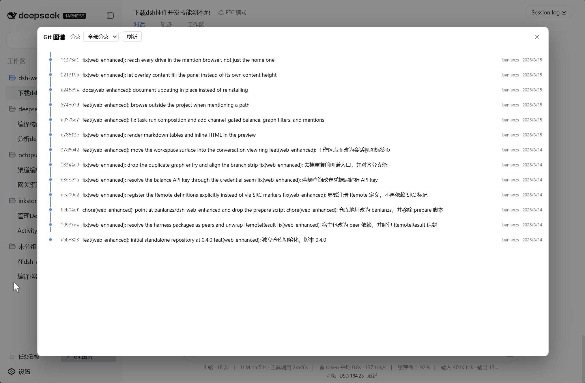
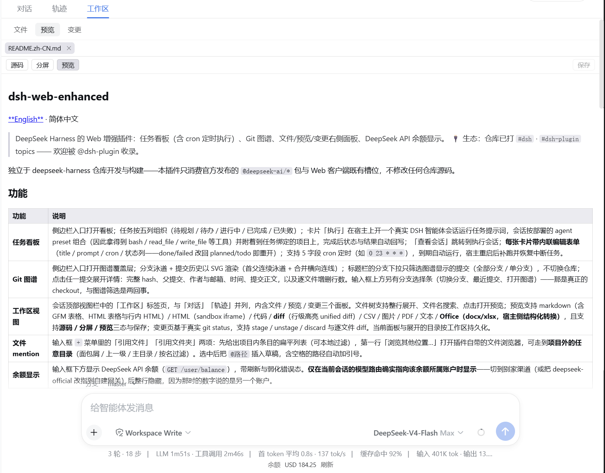
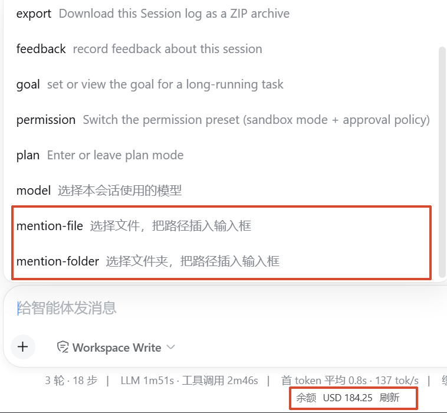

# dsh-web-enhanced

<div align="center">

[**English**](./README.md) · 简体中文

</div>

> DeepSeek Harness 的 Web 增强插件：任务看板（含 cron 定时执行）、Git 图谱、文件/预览/变更右侧面板、DeepSeek API 余额显示。
>
> 🔌 生态：仓库已打 `#dsh` · `#dsh-plugin` topics —— 欢迎被 @dsh-plugin 收录。

独立于 deepseek-harness 仓库开发与构建——本插件只消费官方发布的 `@deepseek-ai/*` 包与 Web 客户端既有槽位，不修改任何仓库源码。

## 功能

| 功能 | 说明 |
|---|---|
| **任务看板** | 侧边栏入口打开看板；任务按五列组织（待规划 / 待办 / 进行中 / 已完成 / 已失败）；卡片「执行」在宿主上开一个真实 DSH 智能体会话运行任务提示词，会话按部署的 agent preset 组合（因此拿得到 bash / read_file / write_file 等工具）并附着到任务绑定的项目上，完成后状态与结果自动回写；「查看会话」跳转到执行会话；**每张卡片带内联编辑表单**（title / prompt / cron / 状态列——done/failed 改回 planned/todo 即重开）；支持 5 字段 cron 定时（如 `0 23 * * *`），到期自动运行，宿主重启后补跑并恢复中断任务。 |
| **Git 图谱** | 侧边栏入口打开图谱覆盖层；分支泳道 + 提交历史以 SVG 渲染（首父连续泳道 + 合并横向连线）；标题栏的分支下拉只筛选图谱显示的提交（全部分支 / 单分支），不切换仓库；点击任一提交展开详情：完整 hash、父提交、作者与邮箱、时间、提交正文，以及逐文件增删行数。输入框上方另有分支选择条（切换分支、最近提交、打开图谱）——那是真正的 checkout，与图谱筛选是两回事。 |
| **工作区视图** | 会话顶部视图栏中的「工作区」标签页，与「对话」「轨迹」并列，内含文件 / 预览 / 变更三个面板。文件树支持整行展开、文件名搜索、点击打开预览；预览支持 markdown（含 GFM 表格、HTML 表格与行内 HTML）/ HTML（sandbox iframe）/ 代码 / **diff**（行级高亮 unified diff）/ CSV / 图片 / PDF / 文本 / **Office（docx/xlsx，宿主侧结构化转换）**，且支持**源码 / 分屏 / 预览**三态与保存；变更页基于真实 git status，支持 stage / unstage / discard 与逐文件 diff。当前面板与展开的目录按工作区持久化。 |
| **文件 mention** | 输入框 `+` 菜单里的「引用文件」「引用文件夹」两项：先给出项目内条目的扁平列表（可本地过滤），第一行「浏览其他位置…」打开插件自带的文件浏览器，可走到**项目外的任意目录**（面包屑 / 上一级 / 主目录 / 按名过滤）。选中后把 `@路径` 插入草稿，含空格的路径自动加引号。 |
| **余额显示** | 输入框下方显示 DeepSeek API 余额（`GET /user/balance`），带刷新与弱化错误态。**仅在当前会话的模型路由确实指向该余额所属账户时显示**——切到别家渠道（或把 deepseek-official 改指到自建网关）后整行隐藏，因为那时的数字说的是另一个账户。 |

## 截图

由 `scripts/e2e.mjs --capture` 在真实 UI 上截图（无需模型 key）：

| 任务看板 | Git 图谱 |
|---|---|
|  |  |

| 浮动面板 | 余额行 |
|---|---|
|  |  |

## 安装

插件是一个 bundle 组合包（`dsh.bundle`），安装进 Web profile：

```sh
dsh plugin --profile web add git+https://github.com/banlanzs/dsh-web-enhanced.git   # 推荐
# 或：
# dsh plugin --profile web add ./dsh-web-enhanced-0.5.0.tgz
# dsh plugin --profile web add dsh-web-enhanced
```

`lib/` 随仓提交，因此没有 `prepare` 步骤——从 git 安装无需工具链，也不会提示 `allowBuilds`。

> **要安装，不要 `link:`。** 所有 `@deepseek-ai/*` 都是 **peer** 依赖，必须解析到 profile 提供的那一份。Node 解析符号链接包时以其**真实路径**为起点，所以 `link:` 安装的插件会在自己的 `node_modules` 里解析这些包——于是有了第二份 `@deepseek-ai/dsh-typert-protocol`。`@Remote` 装饰器把标记记录在该模块的私有状态里，持有另一份实例的 host 网关因此看不到任何 descriptor，`/api/webEnhanced/*` 全部返回 **404**，而客户端半仍能正常加载渲染（故障表现具有迷惑性）。怀疑安装有问题时这样验证：
>
> ```sh
> node -e "console.log(require.resolve('@deepseek-ai/dsh-typert-protocol',{paths:['<profile>']}))"
> node -e "console.log(require.resolve('@deepseek-ai/dsh-typert-protocol',{paths:['<plugin>/lib']}))"
> ```
>
> 两条路径必须完全一致。

然后启动：

```sh
dsh --profile web
```

### 一键安装脚本

clone 后直接运行——脚本会检查前置（dsh / pnpm / 仓库可达），用公开 git URL 安装并提示重启：

```sh
git clone https://github.com/banlanzs/dsh-web-enhanced.git
cd dsh-web-enhanced
./scripts/install.sh
```

### 更新

**不需要先卸载再装。** `dsh plugin` 是一个 pnpm 转发器：它把参数原样交给 profile 目录里的 `pnpm` 执行，再按**已安装状态**重新对齐 bundle 层列表。所以更新就是一条命令，然后重启 DSH：

```sh
dsh plugin --profile web update dsh-web-enhanced
dsh --profile web
```

要点：**`install` 拉不到新提交，`update` 才行。** `github:banlanzs/dsh-web-enhanced` 这种没写 ref 的 spec 跟的是默认分支，但 pnpm 会把当时解析到的 commit 钉进 profile 的锁文件：

```
dsh-web-enhanced: github:banlanzs/dsh-web-enhanced
  → codeload.github.com/banlanzs/dsh-web-enhanced/tar.gz/<commit>
```

`pnpm install` 尊重锁文件、只会重装同一个 commit；`update` 会重新解析分支 HEAD 并改写锁文件。

层列表按「已安装状态」而不是「依赖差异」对齐是刻意的：这样某个包在新版本里**才开始**声明 `dsh.bundle` 时，`update` 也能把它加进层栈。

万一某次 `update` 没动（pnpm 对 git 依赖偶尔会啃缓存），退路依次是 `--force`，再不行才是 remove + add：

```sh
dsh plugin --profile web update --force dsh-web-enhanced
# 仍然不动时的兜底
dsh plugin --profile web remove dsh-web-enhanced
dsh plugin --profile web add git+https://github.com/banlanzs/dsh-web-enhanced.git
```

### 开发迭代

本插件**不能**用 `link:`（见上文提示——它会复制一份宿主包，从而静默地让所有
host 能力失效）。改用打包重装来迭代：

```sh
cd dsh-web-enhanced
pnpm install && pnpm run check && npm pack
dsh plugin --profile web remove dsh-web-enhanced
dsh plugin --profile web add ./dsh-web-enhanced-0.5.0.tgz
```

Windows 上 tarball 安装需要真正的符号链接权限（pnpm 的 `importPackage` 步骤）。
若报 `EPERM ... symlink`，可开启开发者模式，或改用 git URL 安装（不走该路径）。

## 配置

插件行 config 字段（均有默认值）：

| key | 默认 | 含义 |
|---|---|---|
| `cronIntervalMs` | 30000 | 调度器 tick 间隔 |
| `balanceApiKeyEnv` | `DEEPSEEK_API_KEY` | 余额查询的 API key 环境变量 |
| `balanceCacheTtlMs` | 60000 | 余额视图缓存时长 |
| `balanceBaseUrl` | `https://api.deepseek.com` | 余额端点基址 |
| `balanceProviders` | `[deepseek-official]` | 余额行只对这些模型渠道显示；渠道另配了 baseURL 时还要与端点同主机 |
| `skipDirs` | `[node_modules]` | 文件树/搜索跳过的目录（`.git` 恒跳过） |
| `readMaxBytes` | 1 MiB | 文本读取上限（超出截断标记） |
| `writeMaxBytes` | 2 MiB | 文件写入上限 |
| `binaryMaxBytes` | 5 MiB | 二进制预览（base64）上限 |
| `gitOutputMaxBytes` | 256 KiB | git 单流输出上限 |
| `gitMaxCount` | 100 | git log 行数上限 |
| `searchMaxDepth` / `searchMaxEntries` | 8 / 200 | 文件搜索深度与条数上限 |
| `officeMaxBytes` | 5 MiB | Office（docx/xlsx）预览文件大小上限 |
| `browseMaxEntries` | 500 | mention 浏览器单层目录的条目上限 |

## 架构要点

- **零仓库改动**：客户端 UI 只注册到既有槽位——`sidebar.footer.action`（看板/图谱入口）、`shell.overlay`（看板与图谱浮层本体）、`conversation.view`（工作区视图标签页）、`conversation.input.dock`（分支条）、`conversation.composer.dock`（余额行），外加通过 `ctx.commandUi.register` 注册的两个客户端命令（`+` 菜单里的文件 / 文件夹 mention）。未占用布局的 `details` 槽：那是已被 ui-conversation 的 `DetailsPanel` 占据的 `single` 槽，注册进去会顶掉工具详情列。
- **可选服务一律非注入读取**：`agentPresets`、`llm`、`settings`、`credentials`、`modelDirectories`、`commandUi`、`conversation` 都用 `ctx.get()` 取，缺任何一个只让对应的那一小块降级，不会让插件入口卡住不启动。
- **任务执行**：`agentPresets.resolve()` 解析部署默认 preset → 写进 `meta.agentPreset` → 在 `setup` 里 `mount`（与宿主 `ensureSession` 同序），随后 `workspace.attachSession` 把会话记到项目上；之后 `followup` + `whenIdle` + `sessions.flush`，结果按 `turn/end` reason 回写。没有 preset 名册的部署照常运行，只是会话只带宿主根注册的工具。
- **手写 remote contribution**：host 方法用 `@Remote` 装饰器（Typert SRC 模式，宿主网关自动发现 `ctx.webEnhanced` 服务）；客户端在 apply 里 `ctx.remote.$mount()` 手写的 src-json contribution，无需 typert 生成管线。
- **持久化**：任务记录存 `ctx.storageDomain` 域 `web_enhanced`（JSON 后端），重启恢复 running → failed（host-restart）。
- **路径安全**：所有 fs/git 路径经工作区根校验（拒绝绝对路径、`..`、反斜杠）；单 ref 参数拒绝 `-` 开头、`..` 范围与空白/通配（防止一个参数变成两个或变成选项）；git 输出有界收集；文件读有字节上限与二进制嗅探。Office 文件在宿主侧用 fflate 解包为有界结构化 blocks（标题/段落/列表/表格，≤ 2000 块、≤ 200×50 表格），绝不产出原始 HTML。
- **唯一的例外：`fsBrowse`**。它列出任意绝对目录，不受工作区根约束——因为 mention 产出的只是一个**路径字符串**，而用户要的路径可能就在项目外。它只返回名称、类型与大小；读、写、预览仍然全部锁在工作区内。
- **预览安全**：markdown / CSV / diff / Office / 表格全部渲染为 React 元素，从不 `dangerouslySetInnerHTML`。markdown 里的 HTML 走白名单映射到对应元素，未知标签只丢标记保留文字，`script`/`style` 连内容一起丢；`javascript:`/`data:` 链接降级为字面文本（`data:image/*` 的图片除外），HTML 文件预览进 `sandbox=""` iframe。

## 开发

```sh
pnpm install
pnpm run check   # typecheck + 全部测试 + 构建（173 个测试）
```

构建产物：
- `lib/index.js` — node half：`web-enhanced` 函数插件（挂载 `WebEnhancedGateway` Typert 服务：task*/git*/fs*/balanceGet + cron 调度器 + 重启恢复）
- `lib/client.js` — 浏览器 half：模块加载器闭包格式（`window.__ModuleLoader__.load`），由 `dsh.client` manifest 声明
- `cordis.patch.yml` — bundle 补丁：插入 `web-enhanced` 行（一个行同时承载 node 与 browser 两个 half）

### 真机 e2e（无模型 key）

真实链路全跑：临时 dsh web → 安装插件 → 浏览器打开侧边栏看板/图谱、会话浮动面板与余额行，全程不 mock：

```sh
# 需要宿主构建：DSH_ROOT（默认 ~/.dsh/source/current）内先 pnpm run build
node scripts/e2e.mjs --smoke --install link --port 3190
node scripts/e2e.mjs --capture   # 顺带刷新本 README 使用的 assets/*.png
```

前置：PATH 上有 `dsh`/`pnpm`，以及主仓 web 构建产物（playwright 从主仓解析）。PASS 退出码 0；失败保留 `e2e-fail-*.png` 截图并打印 `dsh-web.log` 尾部。

## 已知限制

- 工作区为视图标签页而非并排列：激活时取代对话记录显示，而不是与其并排；它自身不拥有宽度与折叠状态。
- markdown 中的 HTML 只做白名单渲染：`<table>` 按结构解析，行内标签映射到对应元素，其余标签只保留文字。`<details>`、内联 `style`、自定义元素不还原。
- mention 的项目内列表一次性列出宿主搜索上限（`searchMaxEntries`，默认 200）内的条目，弹层内的搜索是对这批结果的本地过滤，不是逐键重新查询；要越过这个上限或走到项目外，用第一行的「浏览其他位置…」。
- mention 浏览器是应用内的文件管理器，不调系统对话框：宿主的 `host.pickDirectory` 只选目录且只在 `native` 能力下可用，浏览器的 `<input type="file">` 出于安全也不给绝对路径。
- Office 预览为结构化视图：docx 的标题/段落/列表/表格与 xlsx 首个工作表可预览；内联样式（加粗/颜色）、图片与多工作表不保留。旧版 `.doc`/`.xls` 二进制格式不支持预览。
- 定时任务为 best-effort：tick 粒度 30s，宿主关机期间错过的窗口在启动时补跑一次，不留积压。
- 余额 key 与模型提供商同源（环境变量）；未配置时显示错误态而非报错。切到非 `balanceProviders` 的渠道时整行隐藏。
- 图谱泳道为简化算法（首父连续性），非 git 完整拓扑着色；提交详情的文件清单按首父 diff 统计，合并提交因此只显示它带进来的改动。

## License

MIT
